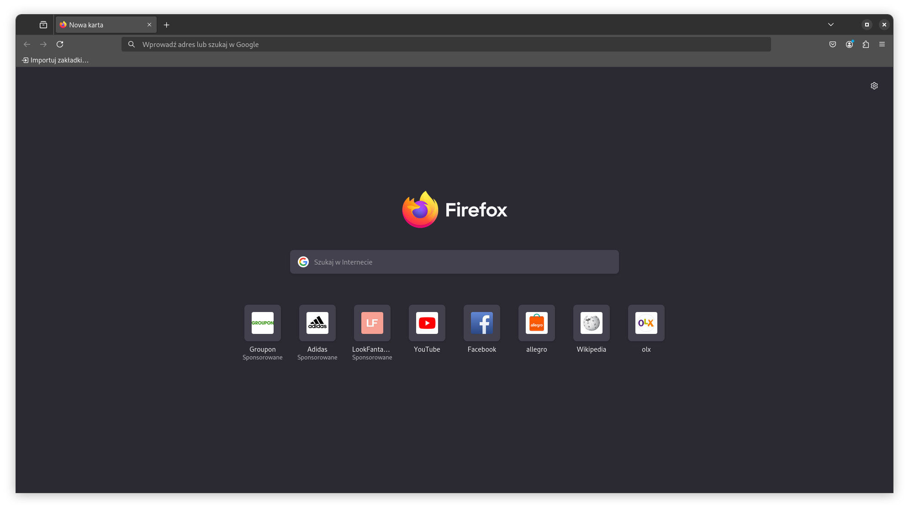
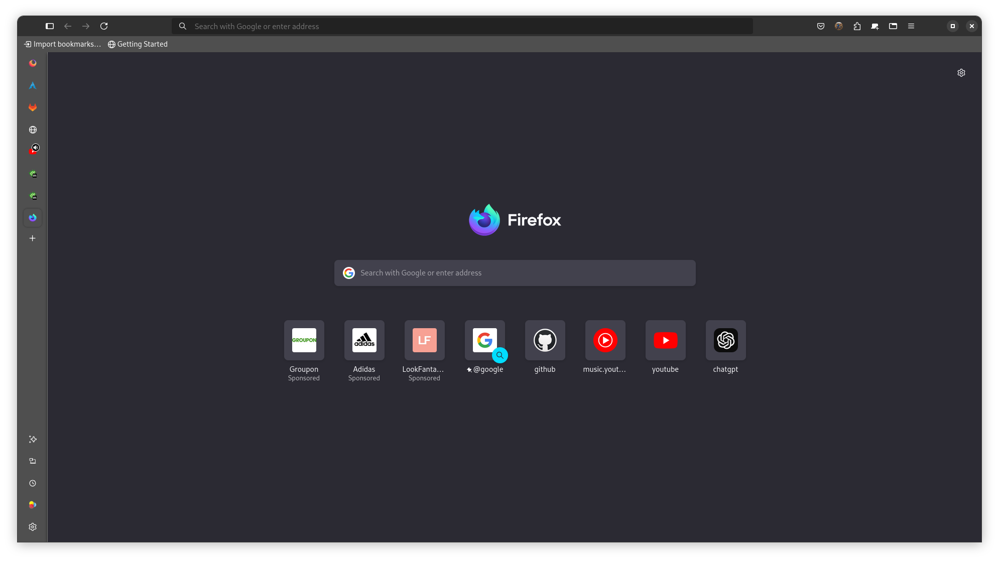

# Why is it broken



### scrolling issue

## on wayland

firefox on xwayland (or x11) dosen't let you scroll with touch screen
like on mobile devices to mitigate this you should install a
wayland compositor like [gnome](./switch-de.md)

<details>
<summary>issue of the past</summary>

firefox 121 and above defaults to wayland if posible but

firefox-esr on debian (testing and below) was on version 115
untill 2024-10-02 now it's 128 [see](https://tracker.debian.org/pkg/firefox-esr)

so now as long as you use wayland de you should have no issue with
navigating device with touch screen

</details>

## on X11

If you are using X.Org (e.g. MATE/XFCE), then 

1. open `about:config` in firefox to set `dom.w3c_touch_events.enabled=1` (default is 2).

2. edit `/etc/security/pam_env.conf` and add `MOZ_USE_XINPUT2 DEFAULT=1`

3. reboot and restart firefox

Source: https://askubuntu.com/a/994483/124466

### on screen keyboard issue

gnome osk (on screen keyboard) has some issue when with using backspace
inside firefox. [the issue](https://bugzilla.mozilla.org/show_bug.cgi?id=1863611) has already been fixed in firefox 132
but firefox in debian repos is still on 128 (testing and below) and 131 (sid)

in order to get it to work propertly we need a nightly build of firefox



by

1. creatig keyring directory
```
sudo install -d -m 0755 /etc/apt/keyrings
```
2. adding apt sign key 
```
wget -q https://packages.mozilla.org/apt/repo-signing-key.gpg -O- | sudo tee /etc/apt/keyrings/packages.mozilla.org.asc > /dev/null
```
3. adding mozilla repo
```
echo "deb [signed-by=/etc/apt/keyrings/packages.mozilla.org.asc] https://packages.mozilla.org/apt mozilla main" | sudo tee -a /etc/apt/sources.list.d/mozilla.list > /dev/null
```
4. prioritizing mozilla packges
```
echo '
Package: *
Pin: origin packages.mozilla.org
Pin-Priority: 1000
' | sudo tee /etc/apt/preferences.d/mozilla 
```
5. installing firefox nightly
```
sudo apt install firefox-nightly
```